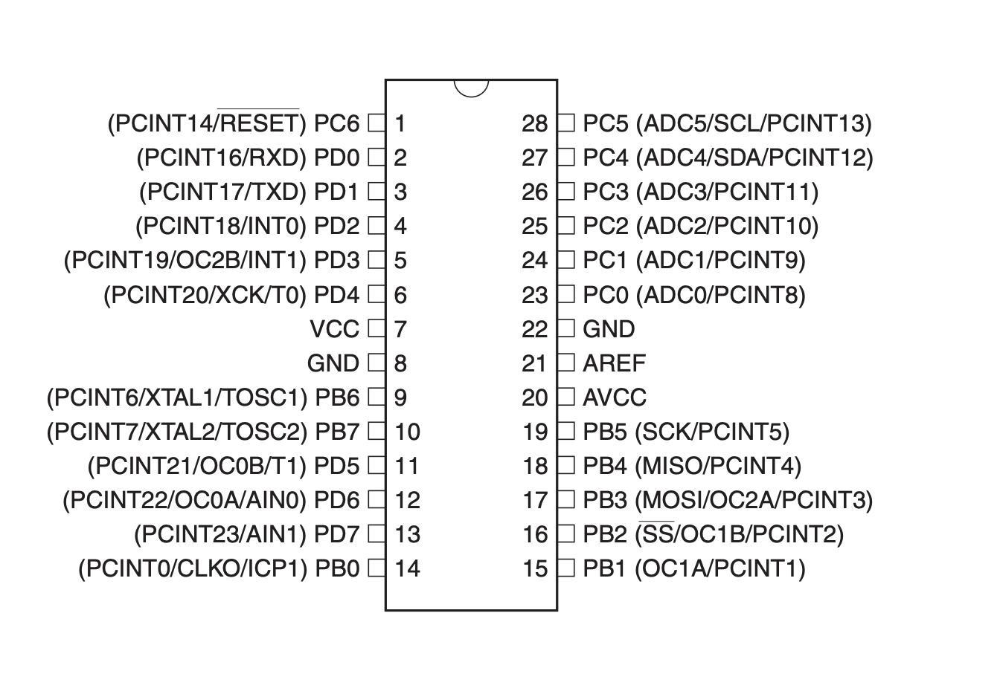

# ATmega48A - Binäruhr

## Pin-Belegung

### Stunden-LEDs
Stunde 20: `PD7`  
Stunde 21: `PD6`  
Stunde 22: `PD5`  
Stunde 23: `PD4`  
Stunde 24: `PD3`
### Minuten-LEDs
Minute 20: `PC5`  
Minute 21: `PC4`  
Minute 22: `PC3`     
Minute 23: `PC2`  
Minute 24: `PC1`  
Minute 25: `PC0`  
### Buttons  
Button 1: `PB0`  
Button 2: `PB1`  
Button 3: `PD2`
### Sonstiges
Uhrenquarz: `PB6` + `PB7`  
Zeitmessung: `PD0`

## Funktionalität
Im Standardbetrieb startet die Uhr beim Einlegen der Batterie bei 12:00 Uhr.
### Tasterbelegung
Über das Drücken des Taster 1 wird der Energiesparmodus aktiviert (siehe [Energiesparmodus](#Energiesparmodus)). Über ein weiteres Drücken des Tasters wird der Energiesparmodus wieder deaktiviert.  
Mithilfe des Taster 2 lassen sich die Stundenzahlen, welche auf der Uhr angezeigt werden, inkrementiert. Diese gehen hoch bis 23 und starten danach wieder bei 0.  
Der dritte Taster dient dem Inkrementieren der Minuten. Diese gehen hoch bis zur 59 und wechseln danach wieder auf die 0.
Durch das gleichzeitige Drücken von Taster 1 und 2 wird in den Test-Modus für die Genauigkeit gewechselt (siehe [Zeitmessung](#Zeitmessung)). Um wieder in den normalen Betriebsmodus zu wechseln müssen erneut Button 1 und 2 gedrückt werden.
Durch das gleichzeitige Drücken von Taster 2 und 3 wird die Helligkeitsstufe um eine Stufe erhöht (siehe [Helligkeitssteuerung](#Helligkeitssteuerung))
### Zeitmessung 
Das Aktivieren dieses Modus wird dadurch gekennzeichnet, dass alle LEDs 2 Sekunden lange aufleuchten. Danach werden alle LEDs deaktiviert. Nun wird am Pin`PD0`im Sekundentakt von High- auf Low Pegel umgeschalten. Während dies passiert sind alle Buttons ohne Funktion und PWM ist deaktiviert. Um den Modus wieder zu verlassen, müssen erneut Button 1 und 2 gedrückt werden. Alle LEDs leuchten drei mal hintereinander kurz auf. Danach befindet sich die Uhr wieder im normalen Betriebsmodus und die Ausgabe an PD0 ist deaktiviert.
### Energiesparmodus
Der Energiesparmodus schaltet die LEDs aus und wechselt in den Power-Save-Mode des ATmega. Über einen Interrupt am Pin `PD0` kann dieser wieder in den normalen Betriebsmodus geholt werden. Während des Energiesparmodus verlieren die Taster **nicht** ihre Funktion. Sie können weiterhin benutzt werden, um die Uhrzeit zu verstellen bzw. Taster 1 um aus dem Sleep Modus wieder zu erwachen.
### Helligkeitssteuerung
Mithilfe der Pulsweitenmodulation lässt sich über das Drücken von Taster 2 + 3 die Helligkeit 10 Stufen regeln. Dieser zirkulieren von der niedrigsten Stufe hoch zur höchsten und fangen dann wieder bei der niedrigsten Stufe an. Die Helligkeitseinstellungen werden auch beim Ein- und Ausschalten des Energiesparmodus gespeichert.
### Auto Sleep
Wenn 2:30 Minuten lang an der Uhr kein Taster gedrückt wird, so geht die Uhr automatisch in den Energiesparmodus. Sie verhält sich dann genau so, als hätte man den Taster 1 gedrückt. Der Timer setzt sicht jedes mal, wenn ein Taster gedrueckt wird zurück.